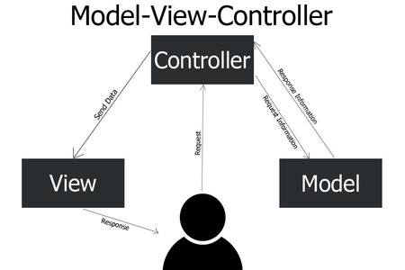

# Основы MVC

Перед началом работы с фреймворком Symfony необходимо понять две базовых концепции:
* Архитектура MVC
* Маршрутизация

## Архитектура MVC

> [!NOTE]
> Фреймворк Symfony основан на архитектуре MVC

**MVC (Model - View - Controller)** – архитектура,  в котором данные приложения и управляющая логика разделяются на 3 компонента: Модель (Model), Представление (View), Контроллер (Controller).

* **Модель (Model)** – компонент, отвечающий за данные приложения и правила работы над ними. **Например**, если это блог, то модель содержит информацию о статьях, авторах, комментариях.
* **Представление (View)** – компонент, отвечающий за отображение. Говоря простыми словами, это то, что видит пользователь и с помощью чего взаимодействует с веб-приложением. **Например**: веб-страница с отображением статьи и комментариев.
* **Контроллер (Controller)** – компонент, отвечающий за связь Model и View. Контроллер обрабатывает входящие запросы от пользователя. Он получает данные от модели и формирует представление, возвращая клиенту ответ в виде HTML страницы либо в виде JSON или XML. **Например**: контроллер получает запрос на отображение статьи с номером 1, он получает данные статьи из модели и передает их представлению, генерируя HTML-страницу.

     

## Маршрутизация

**Маршрутизация** – это процесс определения, какой код будет выполнен или какая страница будет возвращена клиенту при переходе по определенному URL-адресу. **Например**, когда пользователь переходит по URL: http://test.dev/blog/1 ему будет отображена страница с блогом под номер **1**.

При переходе по конкретному URL-адресу, веб-приложение связывает этот адрес с определенной функцией или набором инструкций. 

Таким образом, маршрутизация обеспечивает связь между URL-адресами и выполнением конкретных действий в приложении.

## Связь маршрутизации и архитектуры MVC 

Ознакомившись с понятиями архитектуры MVC и маршрутизации, можно установить между ними связь:

1. Пользователь осуществляет переход по конкретному URL-адресу в веб-браузере.
2. Вступает в действие механизм маршрутизации веб-приложения, который анализирует этот URL.
3. Маршрутизация сопоставляет этот URL с определенным контроллером в приложении.
4. Контроллер получает запрос и начинает обрабатывать его в соответствии с заданными правилами и логикой.
5. Контроллер может обращаться к модели для получения необходимых данных или выполнения определенных операций.
6. После обработки запроса, контроллер генерирует соответствующий ответ, который может быть представлен в виде HTML-страницы, JSON-данных и т.д.
7. Веб-приложение отображает полученный ответ на экране пользователя, завершая процесс взаимодействия.

> [!NOTE]
> Более подробно, данная связь будет продемонстрирована непосредственно при работе с Symfony